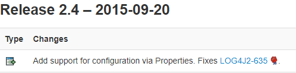
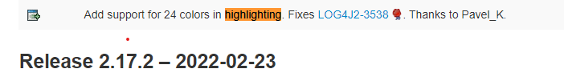

# ssm
## architecture
### database connection
when disconnect from tomcat, you should call DBUtils.close(Connection conn);
or think about using a connection pooling\

### proxy design pattern
Every time execute a query, you should try to retrieve the result from redis, if there're no results,
then turn to mysql(database). But you should realize the function by proxy or aop of Spring Framework,

## technology
## difficulties

## log4j
configuration via properties file is not supported since log4j 2.4\
\
and support for 24 colors in highlighting was added in 2.18

